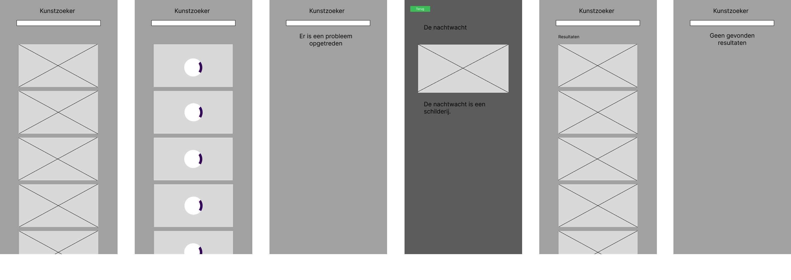
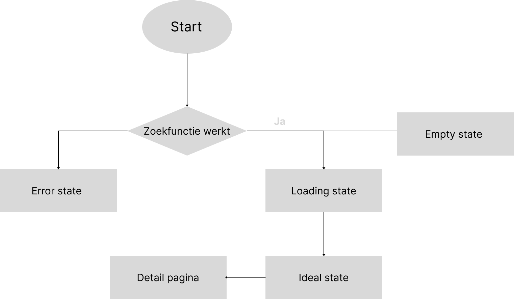

# Kunstzoeker


# Table of contents
1. [Inleiding](#introduction)
2. [Omschrijving](#paragraph1)
    1. [Github Pages](#subparagraph1)
3. [Install](#paragraph2)
    1. [Sections](#subparagraph2)
4. [Activity Diagram](#paragraph3)
5. [Logbook](#paragraph4)
    1. [Week 1](#week1)
    2. [Week 2](#week2)
    3. [Week 3](#week3)
    4. [Week 4](#week4)
6. [Functions](#paragraph5)
7. [Checklist](#paragraph6)

## Inleiding <a name="introduction"></a>
Voor dit project heb ik gekozen om de tweede user story uit te werken:

2. As an art lover, I want to be able to search and view art from the Rijksmuseum at home, so that I can still enjoy art during a lockdown Rijksmuseum - RijksData API

Deze opdracht spreekt mij aan omdat ik hoorde dat je bij de quote API iets minder zou leren, en deze ook zeker te doen zou zijn voor een beginner zoals ik.

## Omschrijving <a name="paragraph1"></a>
Deze repository representeert een Single Page Application die gebouwd is door Daniël Vink. De single application is een kunstzoeker waarin je kan zoeken naar kunstobjecten die de rijksmuseum in haar database heeft staan. Deze kunstobjecten bewerk ik zodat ze als een lijst weergegeven worden in mijn applicatie.

### Github pages <a name="subparagraph1"></a>
https://davi9898.github.io/Kunstzoeker/Kunstzoeker/

## install <a name="paragraph2"></a>
Om deze applicatie ook te gebruiken moet je het volgende doen.
1. Clone de repository
2. Maak een Rijksmuseum account aan op deze <a href="https://www.rijksmuseum.nl/en/research/conduct-research/data">website</a>
3. Vraag in de geadvanceerde instellingen je eigen API key aan.
4. Vervang deze door de API key die bij fillObjectModal.js, fetchData.js en createListItem.js staan. 
5. Run je applicatie op een Live Server 


### Sections <a name="subparagraph2"></a>
Deze applicatie is niet zo zeer complex dat het meerdere sections heeft. Je kan de applicatie gebruiken om te zoeken naar kunstobjecten. Wanneer een gebruiker klikt op een kunstobject zal deze een modal uitschuiven. Hier staat de informatie en een vergroot plaatje van het kunstobject op gepresenteerd. Vervolgens kun je op de back button drukken om terug te gaan naar het hoofdscherm

## Activity Diagram <a name="paragraph3"></a>
Om een duidelijker beeld te geven aan de gebruiker van mijn SPA heb enkele wireframes en een flowchart gemaakt.
Hieronder zie je de wireframes van mijn SPA en de desbetreffende states.<br>
 <br>
Ook is er een bijhorend flowchart te zien om te zien welke functionaliteiten mijn SPA biedt en wat voor mogelijke uitkomsten er zijn.<br>
 <br>

## Logbook <a name="paragraph4"></a>
The second paragraph text

## Week 1 <a name="week1"></a>

### Dag 1
Op de eerste dag van Web-app from scratch ben ik bezig gegaan met het maken van een design voor het scherm van de kunstzoeker. Hieronder staan enkele schermen weergegeven<br>


Na het realiseren van de schetsen van de schermen ben ik me gaan bezig houden met fetchen van de eerste data via de rijksmuseum API. Je doet dit door een private key aan te vragen op de website van het Rijksmuseum. Hiervoor heb je een account nodig.


### Dag 2
Op de tweede dag van web-app from scratch ben ik bezig gegaan om de data daadwerkelijk in een lijst weer te geven. Dit lukte snel doormiddel van de fetch en elementen te creëeren.

### Problemen

Ik liep als allereerst tegen het probleem aan dat de images die gefetched worden enorm groot zijn. Hierdoor kan het soms heel lang duren voordat deze geladen worden op de pagina. De API biedt een functie waarin je kleinere images kan ophalen. Dit doe je door gebruik te maken van tiles in de URL en daar overheen te loopen om het goede formaat te krijgen.

### Oplossing

De API van Rijksmuseum biedt de functie om verschillende tiles te fetchen. Deze tiles staan in een array en hebben allemaal verschillende groottes. Door in JavaScript een if statement te schrijven waarin je meegeeft dat de img niet groter mag zijn dan aangegeven waardes. Zorg je ervoor dat de image die gereturned wordt de juiste afmetingen heeft. Hierdoor is de img grootte klein en worden ze sneller geladen. Interessant om te vermelden is dat ik ook heb gekeken naar LazyLoading. Ik kreeg dit niet aan de praat.

```
function createListItem(aObject) {
  displayLoading()
  let li = document.createElement("li");
  let image = document.createElement("img");


  //Fetch afbeelding data
  const afbeeldingen = 'https://www.rijksmuseum.nl/api/nl/collection/' + aObject.objectNumber + '/tiles?key=Y5aZWyUP'
  fetch(afbeeldingen)
    .then(response => {
      return response.json();
    })
    .then(images => {
      var mobileLevelIndex = 0;
      images.levels.forEach((level, index) => {
        if (level.width <= 750 && level.width > 250) {
          if (images.levels[index].tiles.length == 1) {
            mobileLevelIndex = index;
          }
        }
      })
      image.src = images.levels[mobileLevelIndex].tiles[0].url
    })
    
 ```

### Verdere functionaliteiten 
De volgende functionaliteiten wil ik nog realiseren:
1. SearchQuery
2. States
3. Detail scherm
4. Router
5. Modules
6. Algehele styling

## Week 2 <a name="week2"></a>

### Dag 3
Op de derde dag ben ik begonnen met het maken van het detail scherm. De bedoeling is dat de gebruiker een detail scherm krijgt wanneer er op een schilderij geklikt wordt. Deze schuift dan uit van links en geeft meer informatie over het kunstobject. Ik heb dit gedaan door een hidden class van een section af te halen waardoor hij 100vw verschuift naar rechts. Vervolgens wordt alle data van de API ingeladen op het scherm.
```
 const artObjectUrl = 'https://www.rijksmuseum.nl/api/nl/collection/' + aObject.objectNumber + '?key=Y5aZWyUP'

  fetch(artObjectUrl)
    .then(response => {
      return response.json();
    })
    .then(response => {
      let model = document.querySelector('.details');
      console.log(response.artObject);
      model.querySelector('.details-title').textContent = response.artObject.longTitle;
      model.querySelector('.object-afbeelding').src = response.artObject.webImage.url;
      model.querySelector('.object-omschrijving').textContent = response.artObject.description;
        
     
      model.classList.remove('hidden')

      const terugButton = document.querySelector('button')
      terugButton.addEventListener('click', () => {
        model.classList.add('hidden');
        model.querySelector('.object-afbeelding').src = '';
      })
```
Ook is onderaan de code te zien dat er een terugbutton functionaliteit is toegevoegd. Hierdoor kan de gebruiker op telefoon als in de browser makkelijk terug navigeren. In de catch zit ook een error state verwerkt!

  ```
    .catch(error => {
        let errorState = document.querySelector('.error');
        errorState = remove('error-hidden')
      });
  ```
  
  
### Verdere functionaliteiten 
De volgende functionaliteiten wil ik nog realiseren:
1. SearchQuery
2. Router
3. Modules
4. Algehele styling

### Dag 4

Op dag 4 ben ik bezig gegaan met het toevoegen van de searchQuery aan mijn Kunstzoeker. Ik heb dit gedaan door middel van gebruik te maken van een KeyUp Eventlistener. De waarde hiervaan kun je veranderen zodat er meer letters getypt moeten zijn voordat de search begint te werken:

```
function zoekText() {
    console.log('zoektest draait')
    let zoekWaarde = document.querySelector('[search-input]').value 
    if(zoekWaarde.length > 2){
      fetchData(zoekWaarde)
    }
  }

document.querySelector('[search-input]').addEventListener('keyup', zoekText);
```

Ook heb ik de History API toegevoegd aan mijn Kunstzoeker. Nu geeft de URL een Hash weer met het ID van het kunstobject.
```
window.history.pushState({objectNumber:aObject}, "Kunstobject: aObject.objectNumber", "#"+aObject);
```
Hier kun je zien hoe het ID wordt toegevoegd
```
function checkForHash(){
    console.log(location.hash)// Weergave van specifieke hash
    if(location.hash != ''){
      fillObjectModal(location.hash.split('#')[1]);
      return;
    }
    hideModal();
  }
```
Wanneer de terugbutton gebruikt wordt:
```
history.pushState("", document.title, window.location.pathname + window.location.search);
```

### Verdere functionaliteiten 
De volgende functionaliteiten wil ik nog realiseren:
1. Modules
2. Algehele styling

## Week 3 <a name="week3"></a>

### Dag 5
Vandaag ben ik bezig geweest met het refactoren van m'n code. Het ging erg moeizaam want het werkte niet. Uiteindelijk is het me gelukt om het werkend te krijgen. Ik ben van 10:00 tot 14:00 hier mee bezig geweest.
```
import { fillObjectModal } from "./fillObjectModal.js";
```
Uiteindelijk was het enige wat er fout ging dat ik geen .js achter bij de import had gezet, Hierdoor werkte het niet. Ook heb ik deze dag een error state toegevoegd met behulp van Nigel. Deze werkt doormiddel van als de fetch niet uitgevoerd kan worden dan blijft de error zichtbaar. Echter als de fetch gewoon werkt wordt de textContent een lege string waardoor hij verdwijnt.

### Verdere functionaliteiten 
De volgende functionaliteiten wil ik nog realiseren:
1. Algehele styling

### Dag 6

Op dag 6 ben ik bezig geweest met het toevoegen van een empty state, loading state bij het modal, heel veel bufixing, styling, design review, het maken van een flowchart en een wireframe. Ook ben ik bezig geweest om te kijken of ik de API key kon verbergen, uiteindelijk ben ik erachter gekomen dat ik waarschijnlijk moeite aan het doen was voor niets. 

### Verdere functionaliteiten 
De volgende werkzaamheden moet ik nog doen:
1. Algehele styling
2. Opknappen 

###Week 4 <a name="week4"></a>

### Dag 7

Op dag 7 ben ik bezig geweest met algemene styling. Ook moet ik nog m'n READme in orde maken. Met algemene styling bedoel ik het responsive maken van m'n webapplicatie, ook testen op bugs. 

### Functions <a name="paragraph5"></a>
Bij dit onderdeel licht ik graag toe welke functies ik gemaakt heb en onderling in modules heb gestopt. Dit heb ik gedaan omdat we bij de HVA een functional programming werkwijze hebben.

```js

export function fetchData(query = 'Rembrandt') {

  let parent = document.querySelector('section ul');

  while (parent.firstChild) {
    parent.removeChild(parent.firstChild);
  }

  const artContainer = document.querySelector('main > section:nth-of-type(2)')

  const urlApi = 'https://www.rijksmuseum.nl/api/nl/collection'
  const apiKey = 'BQfKnS2c'
  const ifImage = "imgonly=true";
  const sortedBy = "relevance";
  const resultAmount = "ps=20";

  // String Interpolatie doormiddel van backticks
  // Expressions zijn wrapped in ${}
  const url = `${urlApi}/?key=${apiKey}&q=${query}&${resultAmount}&${ifImage}&s=${sortedBy}`;

  document.querySelector('section:nth-of-type(4) > p').style.display = 'none';

  // return Om Error state te testen.

  fetch(url)
    .then(response => {
      return response.json();
    })
    .then(data => {
   
      if (data.artObjects.length <= 1) {
        document.querySelector('section:nth-of-type(4) > p').style.display = 'flex';
        return;
      }

      data.artObjects.forEach((aObject) => {
        if (!aObject.hasImage) return;

        let listItem = createListItem(aObject)
        document.querySelector('section ul').appendChild(listItem)

        artContainer.textContent = "";

      })
    })
    .catch(error => {
      console.error('Probleem gedetecteerd:', error);
    });
  checkForHash();
}

```

Fetch om query mee uit te voeren, List items toe te voegen, error state. Ook verwijderen we de hele firstChild van de parent om vervolgens een nieuwe toe te voegen. als er gezocht wordt. Ook creëeren we hier de list items door de functie aan te roepen. Helemaal aan het einde van onze fetch voeren we de checkForHash() functie uit.

```js

export function checkForHash() {
  if (location.hash != '') { // De waarde wordt uitgelezen 
    fillObjectModal(location.hash.split('#')[1]); // [1] = ObjectID Alles na het hekje door split
    return;
  }
  hideModal();
}

```
Met deze functie splitsen we het hekje van het objectID zodat we deze kunnen toevoegen aan onze state in de window
```js

export function createListItem(aObject) {

  let li = document.createElement("li");
  let image = document.createElement("img");

  const urlApi = 'https://www.rijksmuseum.nl/api/nl/collection'
  const apiKey = 'BQfKnS2c'

  //Fetch afbeelding data

  const afbeeldingen = `${urlApi}/${aObject.objectNumber}/tiles?key=${apiKey}`;

  fetch(afbeeldingen)
    .then(response => {
      return response.json();
    })
    .then(images => {

      var mobileLevelIndex = 0;

      images.levels.forEach((level, index) => {
        if (level.width <= 750 && level.width > 250) {
          if (images.levels[index].tiles.length == 1) {
            mobileLevelIndex = index;

          }
        }
      })
      image.src = images.levels[mobileLevelIndex].tiles[0].url
    })
    .catch(error => {
      console.error('Probleem gedetecteerd:', error);
    });

  image.setAttribute('rijksobject-nummer', aObject.objectNumber);

  li.addEventListener('click', () => {
    fillObjectModal(aObject.objectNumber);
  })
  li.appendChild(image);
  return li;
}

```
Hier halen we en creëeren we het Listitem door naar de index van de tiles te zoeken die een specifieke width hebben. Hierdoor krijgen we altijd kleine plaatjes waardoor alles sneller laadt.
```js

export function fillObjectModal(aObject) { 

  //Fetch afbeelding data
  const urlApi = 'https://www.rijksmuseum.nl/api/nl/collection'
  const apiKey = 'BQfKnS2c'
  const artObjectUrl = `${urlApi}/${aObject}?key=${apiKey}`

  fetch(artObjectUrl)
    .then(response => {
      return response.json();
    })
    .then(response => {

      let modal = document.querySelector('.details');

      modal.querySelector('section:nth-of-type(3) article h2').textContent = response.artObject.longTitle;
      modal.querySelector('section:nth-of-type(3) article img').src = response.artObject.webImage.url;
      modal.querySelector('section:nth-of-type(3) article p').textContent = response.artObject.description;

      // wanneer description leeg is toon anders..
      if (!response.artObject || !response.artObject.description) {
        modal.querySelector('section:nth-of-type(3) article p').textContent = "Er is geen beschrijving voor dit kunstobject";
      } else {
        modal.querySelector('section:nth-of-type(3) article p').textContent = response.artObject.description;
      }

      // History API Method     #dataObject            N/A                     
      window.history.pushState({ objectNumber: aObject }, null, "#" + aObject);

      modal.classList.remove('hidden')

      let terugButton = document.querySelector('button')
      terugButton.addEventListener('click', () => {
        //Nieuwe state maken, empty
        history.pushState("", null, window.location.pathname + window.location.search);

        modal.classList.add('hidden');

        modal.querySelector('section:nth-of-type(3) article img').src = '';
      })
        .catch(error => {
          console.error('Probleem gedetecteerd:', error);
        });
    })
}

```
Hiermee vullen we het Modal. Ook gebruiken we hier de window.history.pushState zodat er een hash met het objectID in de URL komt te staan.
```js

export function hideModal() {
  let modal = document.querySelector('.details');
  modal.classList.add('hidden');
  modal.querySelector('section:nth-of-type(3) article img').src = '';
}

```
Hiermee verbergen we de Modal.
```js

export function zoekText() {

  let zoekWaarde = document.querySelector('header input').value
  if (zoekWaarde.length > 2 && zoekWaarde != '') {
    fetchData(zoekWaarde)
  } else if (zoekWaarde.length < 2) {
    fetchData('Rembrandt')
  }

}

```
De zoekText functie zorgt er voor dat we een query kunnen uitvoeren. 

## Checklist <a name="paragraph6"></a>
Er kan natuurlijk altijd iets verbeterd worden. Hier een lijst van onderdelen die mooier zouden kunnen:
* Afvangen van 403 errors
* Desktop versie
* Meerdere pagina's voor gebruikers
* Meer informatie voor de gebruiker op de homepagina
